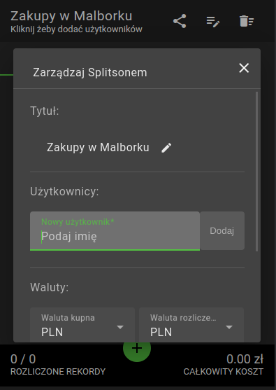
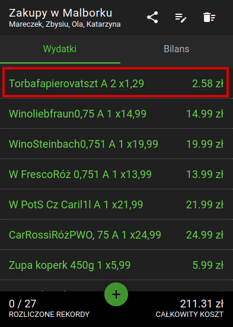

# Splitson https://kacperkk2.github.io/Splitson/

$\textcolor{green}{\textsf{Splitson}}$ to aplikacja bezserwerowa służąca do podziału jakiegokolwiek paragonu lub wydatku pomiędzy grupę ludzi.

## Jak to działa?

1. Nadaj nazwę Splitsonowi (powinna kojarzyć się z momentem kiedy odbyła się płatność)  

   
   
   
  

2. Dodaj użytkowników, pomiędzy których rozliczona powinna zostać płatność  

   
   
   
  

3. Dodaj treść paragonu - pojedyncze rekordy zakończone ceną (dobrze jest skorzystać z innej aplikacji z `OCR image to text` - polecam "Notebloc Scanner")  

   
  
  

4. Zatwierdz dodane rekordy i sprawdź ich listę oraz finalną kwotę w następnym okienku - wszystko powinno zgadzać się z paragonem)  

   
  

5. Przejdź przez wszystkie rekordy i przypisz do nich odpowiednich użytkowników  

   
   
  

6. Przejdź do zakładki `Bilans` i sprawdź kto powinien ile oddać osobie kupującej  
 
7. Zarchiwizuj Splitsona klikając w ikonkę udostępniania (link przechowuje snapshot wszystkich dokonanych zmian i jest aktywny do końca świata i jeszcze dłużej, więc jeśli konieczna będzie poprawka wejdź w udostępniony link, nanieś poprawki i wygeneruj nowy link - pamiętaj o zapisaniu go np. wrzucić na czat na messengerze)

   
   
  

## Zakupy w innej walucie

W ustawieniach Splitsona można wybrać inną walutę dla zakupów a inną dla rozliczenia. Splitson automatycznie przeliczy każdą cenę po podanym kursie, finalny biland pokaże kwotę w walucie rozliczenia.

   
   
  

## Korzyści

1. Jako że Splitson to aplikacja bezserwerowa i jest hostowana przez `Github Pages` to jest dostępna dla każdego 24/7 bez żadnych opłat
2. Udostępniane linki do Splitsona nigdy się nie przedawniają ponieważ każdy link zawiera wszystkie niezbędne dane do odtworzenia Splitsona
3. Aplikacja nie korzystające z serwera jest szybsza ponieważ dane nie są transferowane przez sieć, dodatkowo aplikacja webowa dostępna jest dla każdego bez konieczności instalacji czegokolwiek

## Limitacje 

1. Pojedynczy Splitson nie może być edytowany jednocześnie przez wiele użytkowników
2. Aplikacja na ten moment nie rozwiązuje błędu zaokrąglenia - może zdarzyć się tak że suma wydatków będzie większa lub mniejsza o kilkadziesiąt groszy niż suma na paragonie

## Skracanie linku Splitsona

Udostępniane linki przechowują wszystkie niezbędne dane do odtworzenia Splitsona, więc jak można się domyślać jest on długi. W tym celu wykorzystane zostało api serwisu `is.gd` do skracania linków. Ten serwis ma swoje limity i w momencie kiedy zostaną one przekroczone przez aplikację konieczne jest używanie domyślnych linków. 

## Dodatkowe info

Inspiracją dla tej aplikacji był Tricount (też do rozliczania ale brakowało mi tam pewnych funkcjonalności)
Angular w wersji 16.0.3 (https://github.com/angular/angular-cli)
